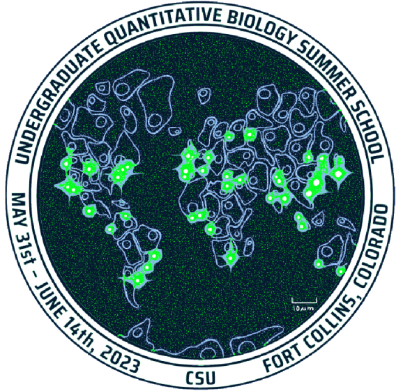

<html>
    

    

        
         
 

 

         
 
              <h1>
               <left> Welcome to the 3rd Annual UQ-Bio Summer School! </left>
              </h1>
              
<left==========================================left> 

              

              Below is the Github repository holding all the links to Colab Notebooks and files needed during the course.
              

           <h2> Authors </h2>
                <pre>
Brian Munsky, Luis Aguilera, William Raymond,  
Michael May, Zachary Fox, Eric Ron, Keisha Cook, 
Kaan Ocal, Ania Baetica, and Carolina Padua.
                </pre>

<a href = "mailto: uqbio.summer.school@gmail.com"> uqbio.summer.school@gmail.com </a> • <a href="https://q-bio.org/wp/uq-bio-schedule-2023/">2023 Undergraduate Summer School Schedule</a>  • <a href="https://q-bio.org/wp/">UQ-Bio</a> •  <a href="https://www.engr.colostate.edu/~munsky/">Munsky Group</a> 

</html>

___

## Modules

<left><h3> Module 0 (Online) : Getting Started with Basic Scientific Computing in Python. </h3></left>
| Date (MST) | Location | Description | Link |
| --------| -------- | -------- | -------- |
| May 22 | Online | Intro to Python: Hello (Python) World, Types, Arithmetic Operations, Iterables, and Containers (Instructor: Zach Fox) |  |  
| May 22 | Online | Intro to Python: Loops, Ranges, Functions, Lambdas, List Comprehension (Instructor: Luis Aguilera)|    |  
| May 22 | Online |  Intro to Python: importing packages, classes/modules, os navigation, reading files (Instructor: Will Raymond) |  |  
| May 22  | Online | Intro to Python: Google Colab environment setup and navigation (Instructor: Will Raymond) |  |  
|  May 22 | Online | Intro to Python: Matplotlib visualization (Instructor: Will Raymond) |     
| May 22 | Online | Intro to Python: NumPy and Linear Algebra Review (Instructor: Michael May)|  |  
| May 22 | Online | Intro to Python: Using OpenAI's GPT3.5 in Python (Instructor: Brian Munsky) |  | 
___

<left><h3> Module 1 : Optical Microscopy Experiments and Image Processing . </h3></left>
| Date (MST) | Location | Description | Link |
| --------| -------- | -------- | -------- |
| May 24 | Online | Python Preliminary Image Loading and Processing (Instructor: Luis Aguilera)|  | 
| May 31 | in person | Tutorial 1.1 —  Basics of Image Processing, Dr. Luis Aguilera (Colorado State University) |  | 
| June 1 | In person | Tutorial 1.2 — Image Segmentation and Tracking, Dr. Carolina Padua (Champalimaud Center for the Unknown, Lisbon, Portugal) |  | 
___

<left><h3> Module 2 :  Multivariable Statistics and Machine Learning for Biological Data. </h3></left>
| Date (MST) | Location | Description | Link |
| --------| -------- | -------- | -------- |
| June 2 | in person | Tutorial 2.1 — Basic statistics, Prof. Ania Baetica (Drexel University) |  |
| June 5 | in person | Tutorial 2.2 – Basics of Regression, Classification and Machine Learning, Dr. Zachary Fox (Oak Ridge National Laboratory) |  | 
___

<left><h3> Module 3 : Stochastic Simulations of Biological Processes. </h3></left>
| Date (MST) | Location | Description | Link |
| --------| -------- | -------- | -------- |
| June 6 | in person | Tutorial 3.1 – Formulating and solving models for gene regulation dynamics, Joshua Cook (Colorado State University) | Coming Soon! | 
| June 7 | in person | Tutorial 3.2 – Sampling from Probability Distributions and Generating Stochastic Simulations, Prof. Keisha Cook (Clemson University) | Coming Soon! | 
| June 8 | in person | Tutorial 3.3 –  Chemical Master Equation, Michael May (Colorado State University) | Coming Soon! | 
___

<left><h3> Module 4 : Master Equation Analyses of Biological Processes. </h3></left>
| Date (MST) | Location | Description | Link |
| --------| -------- | -------- | -------- |
| June 9 | in person | Tutorial 4.1 – Markov Chain Monte Carlo and Model Inference, Kaan Ocal (Edinburgh University) | Coming Soon! | 
___

## UQ-Bio23 Drug Discovery Challenge

[Drug Discovery Challenge Presentation](https://github.com/MunskyGroup/UQBio2023/raw/main/notebook_images/UQBio_Challenge/UQ_Bio_Challenge.pdf)

| Date (MST) | Location | Description | Link |
| --------| -------- | -------- | -------- |
| May 31 | NT135 | Stage 1: Experimental Quantification (Instructor: Luis Aguilera)|  | 
| June 2 | NT135 | Stage 2: Statistical Analysis (Instructor: Ania Baetica and Brian Munsky )|  | 

___

## Breaking news

[Link to the complete story](https://docs.google.com/document/d/1F_C-N5IHQsl1_9x6bO6wEiXv_xAZHcGnUkoAX6Bo-xA/edit?usp=sharing)

___

## Licensing

